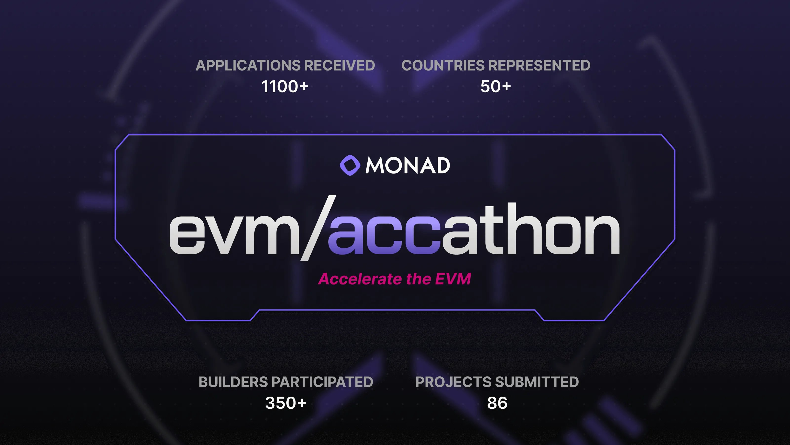
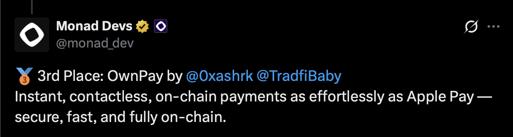
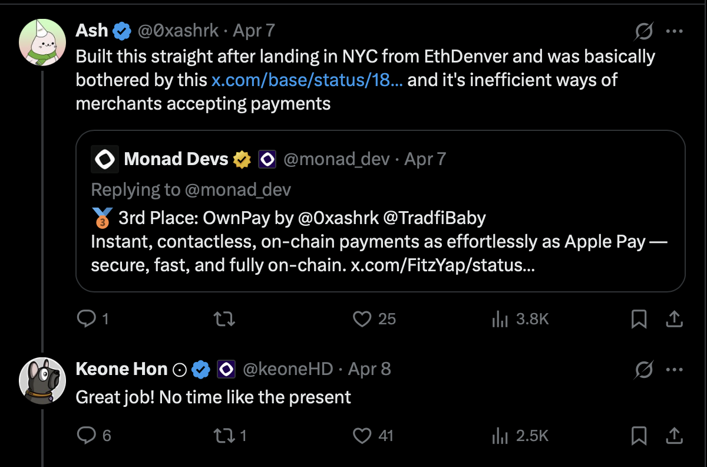
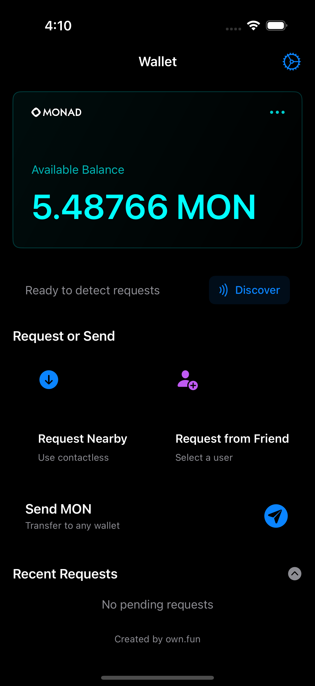
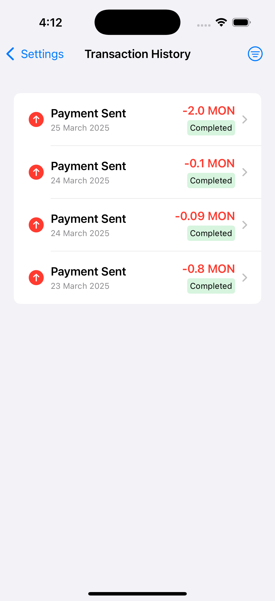
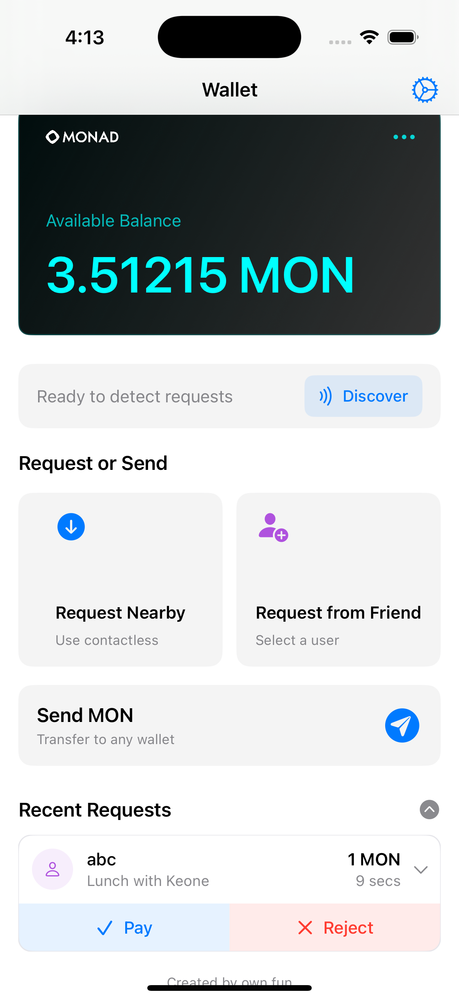
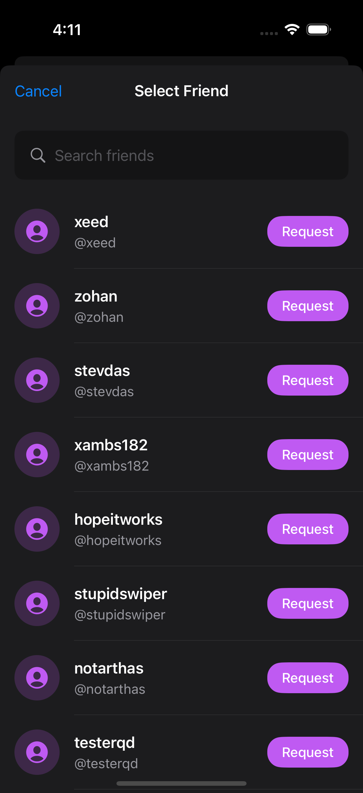
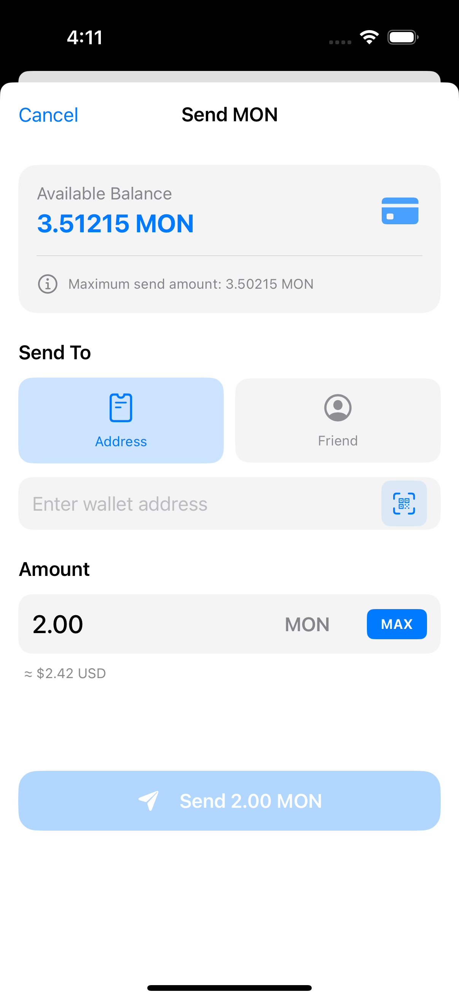
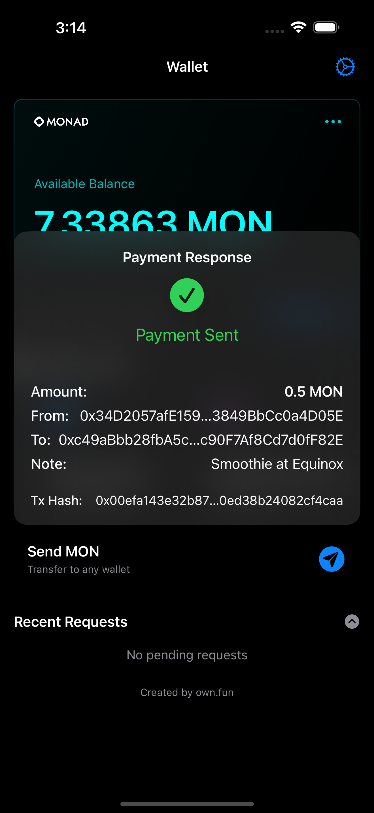
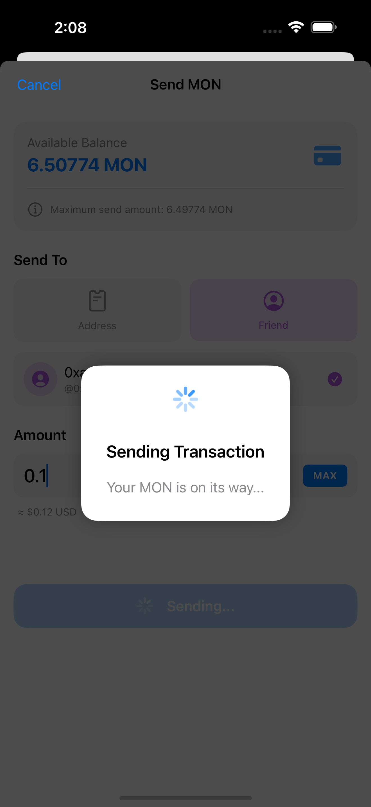

# OwnPay

<div align="center">
  
  ## 🏆 3rd Place Winner - Monad EVM/Accathon 
  ### April 7, 2024 | New York City
  
  
  
  
  
  **1100+ Applications | 350+ Builders | 86 Projects | 50+ Countries**
  
  ### [🎥 Watch Demo Video](https://x.com/monad_dev/status/1909364768735211534)
  
</div>

## The Story



> "Built this straight after landing in NYC from EthDenver and was basically bothered by [this](https://x.com/base/status/1895938456041423003) and its inefficient ways of merchants accepting payments" - [@0xashrk](https://twitter.com/0xashrk)

After witnessing Base network's approach at EthDenver - where food truck merchants had to get customers to scan wallet address barcodes - we knew there had to be a better way. Coming from London where Apple Pay's tap-to-pay experience is ubiquitous, the idea of holding up barcodes felt like a step backward. While QR codes work in Asia, they're cumbersome and potentially insecure when printed on paper.

**We built OwnPay to bring that satisfying Apple Pay "ding" to Web3 payments.**

## Overview
OwnPay is a mobile cryptocurrency payment layer - think PayPal for Web3 - that enables fast, secure, and user-friendly transactions on the Monad blockchain. Unlike traditional wallets, OwnPay works with your existing wallet infrastructure while providing a seamless payment interface. The app facilitates proximity-based payments using Bluetooth technology, allowing users to make payments to nearby devices without the need for QR code scanning or address sharing for each transaction.

> "Instant, contactless, on-chain payments as effortlessly as Apple Pay - secure, fast, and fully on-chain." - Monad Devs

## Passcode for Switching between modes
535445

## Screenshots

<div align="center">
<table>
  <tr>
    <td align="center">
      <br>
      <b>Wallet Home</b><br>
      <i>View balance & discover payments</i>
    </td>
    <td align="center">
      <br>
      <b>Transaction History</b><br>
      <i>Track all your payments</i>
    </td>
  </tr>
  <tr>
    <td align="center">
      <br>
      <b>Request Payment</b><br>
      <i>Quick amounts & notes</i>
    </td>
    <td align="center">
      <br>
      <b>Select Friend</b><br>
      <i>Choose from your network</i>
    </td>
  </tr>
  <tr>
    <td align="center">
      <br>
      <b>Send MON</b><br>
      <i>Transfer to any wallet</i>
    </td>
    <td align="center">
      <br>
      <b>That Apple Pay "Ding"</b><br>
      <i>Instant payment confirmation</i>
    </td>
  </tr>
</table>
</div>

<div align="center">
  <br>
  <b>Lightning Fast Transactions</b><br>
  <i>Seamless payment processing on Monad</i>
</div>

> Note: Screenshots show the actual app interface with real Monad testnet transactions

## Features

### Why OwnPay?
- **Not Another Wallet**: Works as a payment layer on top of your existing wallet infrastructure
- **PayPal-like Experience**: Familiar payment flows for Web3 transactions
- **No More QR Code Dancing**: Unlike traditional crypto payments, no need to fumble with QR codes for every transaction
- **True Contactless Experience**: Just like Apple Pay - discover, tap, pay
- **Merchant-Friendly**: No printed barcodes, no wallet addresses to share repeatedly
- **That Satisfying "Ding"**: The payment confirmation you know and love

### Core Payment Functionality
- **Proximity-Based Payments**: Discover nearby payment requests using Bluetooth Low Energy (BLE)
- **Smart QR Fallback**: QR scanning available but not required for every transaction
- **Multiple Payment Modes**:
  - **Customer Mode**: Send payments to merchants
  - **Merchant Mode**: Request payments from customers
  - **Faucet Mode**: Distribute small amounts of MON to users

### User Experience
- **Apple Pay-Inspired UX**: Smooth, intuitive payment flows with familiar animations
- **Real-Time Payment Status**: Clear visual feedback on payment progress and confirmation
- **Transaction History**: Comprehensive record of past payments
- **Balance Management**: View balance and transaction history from connected wallets

### Security & Protection
- **Wallet Connectivity**: Connect existing wallets via Privy SDK (with potential for more wallet integrations)
- **Sybil Resistance**: Protection against excessive faucet usage with cooldown periods
- **Transaction Verification**: Proper feedback and confirmation for all payments

## Why Monad?

Monad is a high-performance Layer 1 blockchain that brings significant improvements to the EVM ecosystem:

- **10,000 TPS**: Blazing fast transaction throughput for instant payments
- **1-second block times**: Near-instant finality perfect for point-of-sale transactions
- **Full EVM compatibility**: Deploy existing Ethereum smart contracts without modifications
- **Parallel execution**: Optimistic execution with 1000x better performance than Ethereum
- **Low fees**: Efficient consensus mechanism keeps transaction costs minimal

OwnPay leverages Monad's speed to deliver the instant payment confirmations users expect from traditional payment systems like Apple Pay.

## Technical Architecture

### Frontend
- Built with SwiftUI for iOS
- Responsive and animated UI components
- Follows Apple's design guidelines for a native feel

### Backend & Blockchain
- Integrates with Monad blockchain testnet
- Uses Privy SDK for wallet connectivity (extensible to other wallet providers)
- Acts as a payment layer on top of existing wallet infrastructure
- Performs transactions via JSON-RPC calls to the Monad network

### Data Storage
- Uses SwiftData for local transaction history
- Persistent storage for user preferences and settings

### Communication
- Bluetooth Low Energy (BLE) for device-to-device communication
- Structured message format for payment requests and responses

## Getting Started

### Prerequisites
- iOS device with Bluetooth capability
- Xcode 15 or newer
- A Monad testnet wallet (or use the faucet feature to get started)

### Installation
1. Clone the repository
2. Copy the config template:
   ```bash
   cp Config.swift.example Config.swift
   ```
3. Edit `Config.swift` and add your Privy App ID:
   ```swift
   enum Config {
       static let privyAppId = "YOUR_PRIVY_APP_ID_HERE"
   }
   ```
4. Open the project in Xcode
5. Build and run on your iOS device

## Usage Scenarios

### For Customers
1. Open the app and switch to Customer mode
2. Discover nearby payment requests from merchants
3. Review and approve payment requests
4. Receive confirmation when payments complete

### For Merchants
1. Switch to Merchant mode
2. Request specific payment amount
3. Wait for customer to discover and approve payment
4. Receive payment confirmation

### For Faucet Operators
1. Switch to Faucet mode
2. Scan a user's wallet QR code
3. Send a small amount of MON to help them get started

## Privacy & Permissions
Own Pay requires the following permissions:
- Bluetooth: For discovering nearby payment requests and sending responses
- Camera: For scanning QR codes of wallet addresses

## Links

- 🏆 [Winner Announcement on X](https://x.com/monad_dev/status/1909364768735211534)
- 🎥 [Live Demo Video](https://x.com/monad_dev/status/1909364768735211534)
- 🌐 [Monad Network](https://monad.xyz)
- 🔐 [Privy SDK](https://privy.io)

## Acknowledgements

- Monad Blockchain team for hosting the EVM/Accathon
- Privy SDK for wallet infrastructure
- All the builders and judges at the NYC hackathon

- - -

<div align="center">
  Built by <a href="https://twitter.com/0xashrk">@0xashrk</a><br>
  Team: <b>own.fun</b>
</div>
